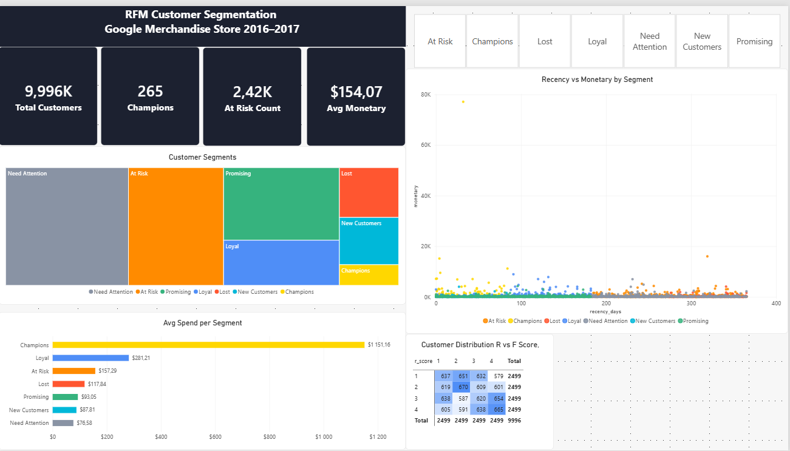

# Projekt 6: Segmentacja klientów RFM — Google Merchandise Store

## Opis projektu
Analiza RFM (Recency, Frequency, Monetary) klientów sklepu Google Merchandise Store 
z wykorzystaniem publicznego datasetu BigQuery. Celem było podzielenie ~10 000 klientów 
na segmenty biznesowe wspierające strategie retencji i marketingu.

## Pytania biznesowe
- Którzy klienci są najbardziej wartościowi i powinni być priorytetem retencji?
- Którzy klienci są zagrożeni odejściem (churn)?
- Jak różni się poziom wydatków między segmentami klientów?
- Jak wygląda rozkład aktywności zakupowej w czasie?

## Narzędzia i technologie
- **SQL**: Google BigQuery (publiczny dataset: `google_analytics_sample`)
- **Wizualizacja**: Power BI Desktop
- **Metody**: Analiza RFM, Window Functions (NTILE), CTE, segmentacja warunkowa

## Dataset
- **Źródło**: `bigquery-public-data.google_analytics_sample.ga_sessions_*`
- **Okres**: sierpień 2016 — sierpień 2017
- **Dane**: 11 515 transakcji → 9 996 unikalnych klientów

## Metodologia

### Scoring RFM
Każdy klient otrzymał score 1–4 w trzech wymiarach przy użyciu `NTILE(4)`:

| Wymiar | Definicja | Logika scoringu |
|---|---|---|
| **Recency** | Liczba dni od ostatniego zakupu | Mniej = lepiej (odwrócone przez `5 - NTILE`) |
| **Frequency** | Liczba zakupów w okresie | Więcej = lepiej |
| **Monetary** | Łączna wartość zakupów ($) | Więcej = lepiej |

### Segmenty klientów

| Segment | Klienci | % bazy | Śr. recency | Śr. zamówienia | Śr. wydatki |
|---|---|---|---|---|---|
| Need Attention | 3 018 | 30.2% | 193 dni | 1.0 | $68.95 |
| At Risk | 2 480 | 24.8% | 274 dni | 1.2 | $169.04 |
| Promising | 1 869 | 18.7% | 100 dni | 1.0 | $96.93 |
| Loyal | 1 119 | 11.2% | 96 dni | 1.4 | $277.55 |
| Lost | 644 | 6.4% | 321 dni | 1.0 | $102.77 |
| New Customers | 611 | 6.1% | 40 dni | 1.0 | $102.01 |
| Champions | 255 | 2.5% | 38 dni | 2.6 | $1 147.08 |

## Kluczowe wnioski

### 1. Champions generują nieproporcjonalnie wysoką wartość
Champions stanowią zaledwie **2.5% bazy klientów**, ale wydają średnio **$1 147** — 
czyli **7.5x więcej** niż przeciętny klient ($154). Retencja tego segmentu 
powinna być absolutnym priorytetem.

### 2. Segment At Risk wymaga natychmiastowego działania
**24.8% wszystkich klientów** (2 480 osób) wykazuje oznaki churnu — wcześniej 
kupowali wielokrotnie, ale są nieaktywni średnio od **274 dni**. 
Ukierunkowana kampania reaktywacyjna mogłaby odzyskać znaczące przychody.

### 3. Duży niezagospodarowany segment środkowy
**Need Attention (30.2%)** to największy segment ze średnimi wydatkami $69 
i 192 dniami od ostatniego zakupu. Odpowiednio dobrana promocja lub 
spersonalizowana rekomendacja może przekonwertować część z nich 
do segmentu Promising lub Loyal.

### 4. Zdrowa akwizycja nowych klientów
611 klientów dokonało pierwszego zakupu niedawno (śr. 40 dni), wydając ~$102. 
Kampanie onboardingowe powinny skupić się na wygenerowaniu drugiego zakupu 
w ciągu 60 dni, aby przenieść ich do segmentu Promising.

## Pliki SQL

| Plik | Opis |
|---|---|
| `01_raw_data.sql` | Ekstrakcja surowych transakcji z sesji GA |
| `02_rfm_values.sql` | Obliczenie wartości R, F, M per klient |
| `03_rfm_scores.sql` | Przypisanie score 1–4 przez NTILE |
| `04_rfm_segments.sql` | Finalna segmentacja z logiką CASE WHEN |
| `05_rfm_summary.sql` | Agregacja zbiorcza per segment |

## Dashboard Power BI

Dashboard zawiera:
- **KPI Cards**: Łączna liczba klientów, Champions, At Risk, Śr. wydatki
- **Treemap**: Rozkład klientów według segmentów
- **Bar Chart**: Średnie wydatki per segment z formatowaniem warunkowym
- **Scatter Plot**: Recency vs Monetary z kolorami segmentów
- **Matrix Heatmap**: Rozkład klientów według score R i F
- **Slicer**: Interaktywny filtr segmentów

